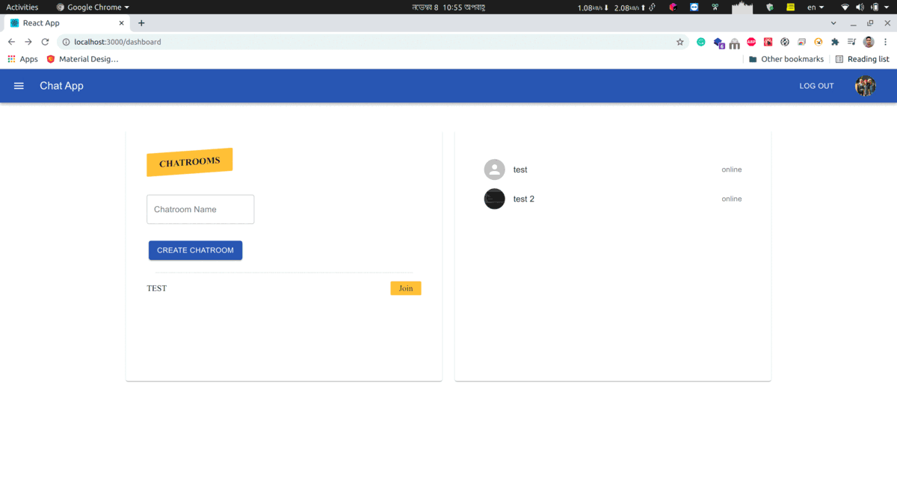

# Chat App
This is a chat app built using **react js**, **express js** and **mongodb**.


**Features**
* User Authentication
* Realtime chat
* chat in group or privately
* Update profile
* Rest API


## Main page

## gif

## some important commands 
```shell
npm start

npm install nodemon -g

sudo systemctl start mongod
sudo systemctl stop mongod
sudo systemctl restart mongod
sudo apt-get purge mongodb-org*
sudo rm -r /var/log/mongodb
sudo rm -r /var/lib/mongodb


```